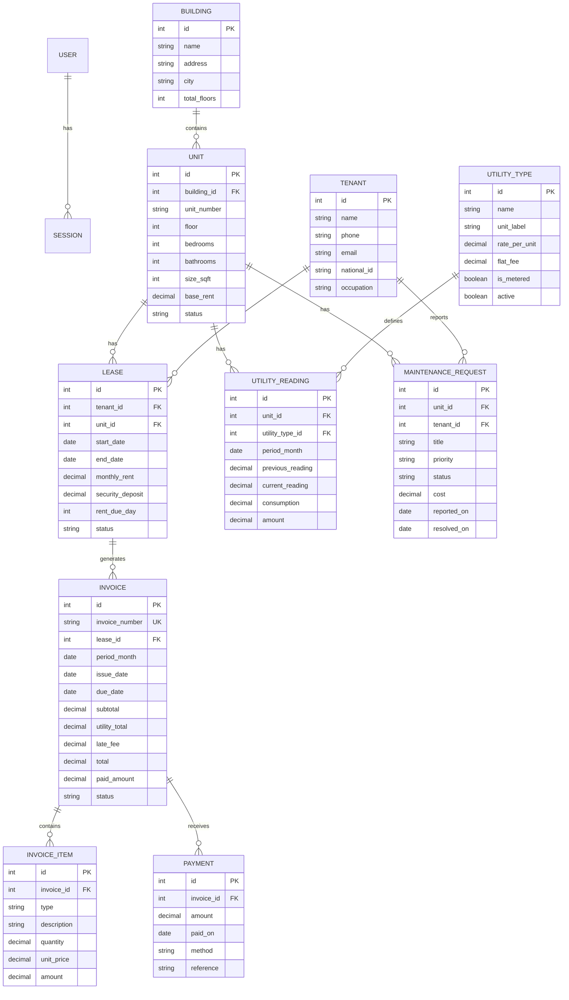

<![CDATA[# 🏢 Building Management System (BMS)

A complete, production-ready **Laravel 11** building management system designed for landlords and property managers. Manage rental properties, utility billing, invoicing, payment collection, maintenance tracking, and generate rich analytical reports — all from a single dashboard.

Built with **zero build tooling** — Tailwind CSS and Chart.js load via CDN, SQLite is the default database. You can be running demo data locally within **2 minutes** of cloning.

---

## ✨ Features at a Glance

| Module | Highlights |
|--------|-----------|
| 🔐 **Authentication** | Single-landlord login with session-based auth, bcrypt password hashing, remember-me |
| 🏢 **Buildings** | Multi-building portfolio with address, city, floor count, and occupancy tracking |
| 🏠 **Units** | Per-unit details: floor, bedrooms, bathrooms, size (sqft), base rent, status (vacant / occupied / maintenance) |
| 👤 **Tenants** | Tenant directory with phone, email, national ID, emergency contact, occupation |
| 📄 **Leases** | Link tenants to units with start/end dates, monthly rent, security deposit, rent due day; auto unit-status sync |
| 🧾 **Invoices** | Single-invoice or one-click bulk monthly generation combining rent + utility line items; auto overdue detection |
| 💵 **Payments** | Record payments via cash / bKash / Nagad / bank / card / other; auto-reconciles invoice balance and status |
| ⚡ **Utilities** | Configurable utility types (metered with rate × consumption, or flat fee); monthly meter readings per unit |
| 🛠 **Maintenance** | Ticket system with priority levels (low / normal / high / urgent), status tracking, cost recording |
| 📈 **Reports** | 4 interactive Chart.js reports: Collection, Dues/Aging, Occupancy, Utilities |
| 🖨 **Print** | Clean, standalone printable invoice layout — print-to-PDF ready |
| 🇧🇩 **Localization** | BDT (৳) by default — easily configurable to USD, INR, PKR, EUR, etc. via `.env` |

---

## 🖼 Dashboard Overview

The dashboard provides a live operational snapshot with:

- **10 KPI cards** — Buildings, Units, Occupied, Vacant, Tenants, Active Leases, Monthly Invoiced/Collected/Due, Total Outstanding
- **6-month trend chart** — Invoiced vs Collected comparison (line chart)
- **Payment method donut** — Breakdown of last 30 days by method
- **Invoice status distribution** — Unpaid / Partial / Paid / Overdue counts
- **Overdue invoice list** — Prioritized by due date
- **Recent activity** — Latest 5 invoices and payments
- **Occupancy & collection rates** — Percentage KPIs

---

## 🚀 Quick Start (2 minutes)

### Requirements

- **PHP 8.2+** with extensions: `pdo_sqlite`, `mbstring`, `openssl`, `bcmath`, `ctype`, `fileinfo`, `tokenizer`, `xml`, `curl`
- **Composer 2+**
- No Node.js, no database server required (SQLite is used by default)

### Installation

```bash
# 1. Clone or unzip the project
git clone https://github.com/your-org/bms.git
cd bms

# 2. Install PHP dependencies
composer install

# 3. Create your .env file
cp .env.example .env

# 4. Generate application key
php artisan key:generate

# 5. Run migrations + seed demo data (creates SQLite DB automatically)
php artisan migrate --seed

# 6. Start the development server
php artisan serve
```

Open **http://localhost:8000** in your browser.

### 🔑 Demo Login

| Email | Password |
|-------|----------|
| `admin@bms.local` | `password` |

### 📦 Demo Data (Seeded)

The `DatabaseSeeder` creates a realistic dataset:

| Entity | Count | Details |
|--------|-------|---------|
| Admin user | 1 | `admin@bms.local` / `password` |
| Buildings | 3 | Dhanmondi Heights, Gulshan Residency (Dhaka), Chattogram Court |
| Units | ~24 | 2 per floor × up to 4 floors per building |
| Tenants | 10 | With realistic Bangladeshi names, phones, occupations |
| Leases | ~17 | ~70% of units occupied, 3–10 months history |
| Utility Types | 4 | Electricity (metered), Water (metered), Gas (flat), Service Charge (flat) |
| Invoices | ~70–100+ | Monthly per lease, combining rent + utility readings |
| Payments | Varied | Realistic patterns: older months fully paid, recent months mixed (paid/partial/unpaid) |
| Maintenance | 5 | Mixed statuses: open, in_progress, resolved |

---

## 🗄 Database Support

### SQLite (Default — Zero Setup)

Works out of the box. The database file is auto-created at `database/database.sqlite` on first migration.

### MySQL / PostgreSQL

Edit `.env`:

```env
DB_CONNECTION=mysql
DB_HOST=127.0.0.1
DB_PORT=3306
DB_DATABASE=bms
DB_USERNAME=root
DB_PASSWORD=yourpassword
```

Then:

```bash
php artisan migrate:fresh --seed
```

> **Note:** All report queries include SQLite/MySQL-compatible SQL. Date grouping uses `strftime()` for SQLite and `DATE_FORMAT()` for MySQL/PostgreSQL automatically.

---

## 💱 Currency / Locale

Change in `.env`:

```env
BMS_CURRENCY=BDT
BMS_CURRENCY_SYMBOL=৳
BMS_DATE_FORMAT="d M Y"
```

**Examples:**

| Currency | `BMS_CURRENCY` | `BMS_CURRENCY_SYMBOL` |
|----------|----------------|----------------------|
| US Dollar | `USD` | `$` |
| Indian Rupee | `INR` | `₹` |
| Pakistani Rupee | `PKR` | `₨` |
| Euro | `EUR` | `€` |
| British Pound | `GBP` | `£` |

---

## 📂 Project Structure

```
bms/
├── app/
│   ├── Http/Controllers/          # 12 controllers
│   │   ├── AuthController.php         # Login / logout / session management
│   │   ├── BuildingController.php     # CRUD for buildings
│   │   ├── DashboardController.php    # KPIs, charts, recent activity
│   │   ├── InvoiceController.php      # CRUD + bulk generate + print
│   │   ├── LeaseController.php        # CRUD + end-lease action
│   │   ├── MaintenanceController.php  # CRUD for maintenance tickets
│   │   ├── PaymentController.php      # CRUD with auto-reconciliation
│   │   ├── ReportController.php       # 4 report endpoints
│   │   ├── TenantController.php       # CRUD + search
│   │   ├── UnitController.php         # CRUD + filtering by building/status
│   │   └── UtilityController.php      # Types CRUD + readings CRUD
│   │
│   ├── Models/                    # 11 Eloquent models
│   │   ├── Building.php               # hasMany: units
│   │   ├── Unit.php                   # belongsTo: building | hasMany: leases, readings
│   │   ├── Tenant.php                 # hasMany: leases
│   │   ├── Lease.php                  # belongsTo: tenant, unit | hasMany: invoices
│   │   ├── Invoice.php                # belongsTo: lease | hasMany: items, payments
│   │   ├── InvoiceItem.php            # belongsTo: invoice (rent / utility line items)
│   │   ├── Payment.php                # belongsTo: invoice
│   │   ├── UtilityType.php            # Electricity, Water, Gas, Service Charge
│   │   ├── UtilityReading.php         # belongsTo: unit, utilityType
│   │   ├── MaintenanceRequest.php     # belongsTo: unit, tenant
│   │   └── User.php                   # Auth user with admin role
│   │
│   ├── Services/
│   │   └── InvoiceService.php     # Invoice generation engine (single + batch)
│   │
│   └── Providers/
│       └── AppServiceProvider.php
│
├── database/
│   ├── migrations/                # 9 migration files
│   │   ├── create_users_table             # users, password_reset_tokens, sessions
│   │   ├── create_cache_table             # framework cache
│   │   ├── create_buildings_table         # name, address, city, total_floors
│   │   ├── create_units_table             # building_id, unit_number, floor, rent, status
│   │   ├── create_tenants_table           # name, phone, email, national_id
│   │   ├── create_leases_table            # tenant_id, unit_id, dates, rent, deposit
│   │   ├── create_utilities_tables        # utility_types + utility_readings
│   │   ├── create_invoices_tables         # invoices + invoice_items + payments
│   │   └── create_maintenance_table       # maintenance_requests
│   │
│   └── seeders/
│       └── DatabaseSeeder.php     # Comprehensive demo data generator
│
├── resources/views/               # 45 Blade templates
│   ├── layouts/app.blade.php          # Master layout: sidebar nav + top bar
│   ├── auth/login.blade.php           # Login page
│   ├── dashboard/index.blade.php      # Dashboard with Chart.js widgets
│   ├── buildings/                     # index, create, edit, show, _form (5)
│   ├── units/                         # index, create, edit, show, _form (5)
│   ├── tenants/                       # index, create, edit, show, _form (5)
│   ├── leases/                        # index, create, edit, show, _form (5)
│   ├── invoices/                      # index, create, edit, show, print, _status (6)
│   ├── payments/                      # index, create, edit, show (4)
│   ├── utilities/                     # index, types, reading_create (3)
│   ├── maintenance/                   # index, create, edit, _form (4)
│   └── reports/                       # index, collection, dues, occupancy, utilities (5)
│
├── routes/
│   ├── web.php                    # All route definitions (~50 routes)
│   └── console.php                # Artisan console routes
│
├── config/                        # 12 Laravel config files
├── public/                        # Web root (.htaccess included)
├── storage/                       # Logs, cache, sessions
├── composer.json                  # PHP dependencies
└── .env.example                   # Environment template
```

**Stats:** 82 source files · ~4,500 lines of application code

---

## 🧩 Entity Relationship Diagram



---

## 🛣 Route Map

All routes are defined in `routes/web.php` and protected by the `auth` middleware (except login).

### Authentication

| Method | URI | Action | Name |
|--------|-----|--------|------|
| `GET` | `/login` | Show login form | `login` |
| `POST` | `/login` | Authenticate | `login.submit` |
| `POST` | `/logout` | Logout | `logout` |

### Dashboard

| Method | URI | Action | Name |
|--------|-----|--------|------|
| `GET` | `/dashboard` | KPIs + charts | `dashboard` |

### Resource CRUD (index / create / store / show / edit / update / destroy)

| Resource | Route prefix | Additional actions |
|----------|-------------|-------------------|
| Buildings | `/buildings` | — |
| Units | `/units` | — |
| Tenants | `/tenants` | — |
| Leases | `/leases` | `POST /leases/{id}/end` — End a lease |
| Invoices | `/invoices` | `POST /invoices/generate-monthly` — Bulk batch<br>`GET /invoices/{id}/print` — Printable view |
| Payments | `/payments` | — |
| Maintenance | `/maintenance` | — (no `show` route) |

### Utilities

| Method | URI | Name |
|--------|-----|------|
| `GET` | `/utilities` | `utilities.index` |
| `GET` | `/utilities/types` | `utilities.types` |
| `POST` | `/utilities/types` | `utilities.types.store` |
| `PUT` | `/utilities/types/{id}` | `utilities.types.update` |
| `DELETE` | `/utilities/types/{id}` | `utilities.types.destroy` |
| `GET` | `/utilities/readings/create` | `utilities.readings.create` |
| `POST` | `/utilities/readings` | `utilities.readings.store` |
| `DELETE` | `/utilities/readings/{id}` | `utilities.readings.destroy` |

### Reports

| Method | URI | Name |
|--------|-----|------|
| `GET` | `/reports` | `reports.index` |
| `GET` | `/reports/collection` | `reports.collection` |
| `GET` | `/reports/dues` | `reports.dues` |
| `GET` | `/reports/occupancy` | `reports.occupancy` |
| `GET` | `/reports/utilities` | `reports.utilities` |

---

## 🔄 Core Workflows

### 1. Onboarding a New Tenant

```
Buildings → New Building (if needed)
    └── Units → New Unit (set base rent)
        └── Tenants → Add Tenant
            └── Leases → New Lease (links tenant → unit; unit auto-marked "occupied")
```

### 2. Monthly Billing Cycle

```
1. Utilities → New Reading        (record electric/water meters for each unit)
2. Invoices → Generate Monthly    (one click: creates invoices for ALL active leases)
3. Payments → Record Payment      (as tenants pay; invoice status auto-updates)
4. Reports → Collection / Dues    (see month-end performance)
```

### 3. Tracking Overdue Invoices

The dashboard highlights overdue invoices in red. The **Dues & Aging** report breaks outstanding amounts into aging buckets:

| Bucket | Days Past Due |
|--------|--------------|
| Current | Not yet due |
| 1–30 | 1 to 30 days overdue |
| 31–60 | 31 to 60 days overdue |
| 61–90 | 61 to 90 days overdue |
| 90+ | Over 90 days overdue |

### 4. Ending a Lease

Click **"End Lease"** on any active lease → unit is automatically marked `vacant` and becomes available for new tenants.

---

## 🏗 Architecture Notes

### Invoice Generation Engine (`InvoiceService`)

- **Idempotent** — Running the monthly batch twice won't create duplicates (unique constraint: `lease_id + period_month`)
- **Two modes** — `generateForLease()` (single) and `generateForMonth()` (batch for all active leases)
- **Auto-numbering** — Format: `INV-YYYYMM-XXXX` (sequential per month)
- **Line items** — Rent line + individual utility lines per invoice

### Payment Reconciliation

- Every payment create / update / delete triggers `Invoice::recalculateStatus()`
- Status transitions: `unpaid → partial → paid` (or `overdue` if past due date)
- `paid_amount` is maintained as a running total on the invoice

### Unit Status Automation

- **Creating a lease** → unit marked `occupied`
- **Ending/deleting a lease** → unit marked `vacant` (only if no other active leases remain)

### Utility Billing

- **Metered types** (Electricity, Water): `consumption × rate_per_unit`
- **Flat-fee types** (Gas, Service Charge): fixed amount per month
- Readings are unique per `unit_id + utility_type_id + period_month`

### Frontend Stack

- **Tailwind CSS** via CDN (zero-build)
- **Chart.js 4.4** via CDN for all charts and reports
- **Inter** (sans-serif) + **Instrument Serif** fonts from Google Fonts
- Custom CSS design system: cards, buttons, badges, nav links, tables, KPI typography
- Responsive sidebar layout (desktop) + mobile top bar

---

## 🔧 Production Deployment

```bash
# Set environment
APP_ENV=production
APP_DEBUG=false
APP_URL=https://yourdomain.com

# Switch to MySQL/PostgreSQL
DB_CONNECTION=mysql
DB_HOST=127.0.0.1
DB_DATABASE=bms_production
DB_USERNAME=bms_user
DB_PASSWORD=strong-password

# Cache for performance
php artisan config:cache
php artisan route:cache
php artisan view:cache

# Point your web server to the /public directory
```

### Apache

The included `.htaccess` handles URL rewriting automatically.

### Nginx

```nginx
server {
    listen 80;
    server_name yourdomain.com;
    root /var/www/bms/public;
    index index.php;

    location / {
        try_files $uri $uri/ /index.php?$query_string;
    }

    location ~ \.php$ {
        fastcgi_pass unix:/run/php/php8.2-fpm.sock;
        fastcgi_param SCRIPT_FILENAME $realpath_root$fastcgi_script_name;
        include fastcgi_params;
    }
}
```

---

## 🔐 Admin Management

### Change Admin Password

```bash
php artisan tinker
>>> User::where('email', 'admin@bms.local')->update(['password' => Hash::make('your-new-password')]);
```

### Create Additional Admin

```php
php artisan tinker
>>> User::create([
    'name' => 'Your Name',
    'email' => 'you@example.com',
    'password' => Hash::make('secret'),
    'role' => 'admin',
]);
```

---

## 🧰 Tech Stack

| Layer | Technology | Version |
|-------|-----------|---------|
| Framework | Laravel | 11.x |
| Language | PHP | ≥ 8.2 |
| Database | SQLite (default) / MySQL / PostgreSQL | — |
| Frontend | Blade templates | — |
| CSS | Tailwind CSS (CDN) | 3.x |
| Charts | Chart.js (CDN) | 4.4 |
| Typography | Google Fonts (Inter, Instrument Serif) | — |
| Testing | PHPUnit | 11.x |
| Linting | Laravel Pint | 1.x |
| Dev Tools | Laravel Sail, Tinker, Ignition | — |

---

## 📝 License

MIT — use freely for commercial or personal projects.

---

<p align="center">
  Built with Laravel 11, Tailwind CSS, and Chart.js · No npm required ❤️
</p>
]]>
